# Merchant Payout App Challenge (iOS)

Welcome to the Merchant Payout Challenge! This is a mobile coding challenge designed to assess your ability to implement a financial payout experience using Swift and SwiftUI.

Your task is to build a merchant dashboard and payout flow that allows users to:

- Review account balances and recent activity with pagination
- Initiate and validate a payout to a bank account with confirmation
- Persist a device identity for payout requests
- Require biometric authentication for payouts over £1,000.00
- Protect the payout screen from screenshots and screen recording
- Handle various edge cases, including network errors and insufficient funds

## Table of Contents

- [Merchant Payout App Challenge (iOS)](#merchant-payout-app-challenge-ios)
  - [Table of Contents](#table-of-contents)
  - [Tech Stack](#tech-stack)
  - [API Documentation](#api-documentation)
    - [Making Requests](#making-requests)
    - [Available Endpoints](#available-endpoints)
    - [Testing Error States](#testing-error-states)
    - [Data Types](#data-types)
  - [Evaluation Criteria](#evaluation-criteria)
  - [Tips](#tips)
  - [Implementation Steps](#implementation-steps)
    - [Step 1 - Merchant Home Screen](#step-1---merchant-home-screen)
    - [Step 2 - Transaction List (Paginated)](#step-2---transaction-list-paginated)
    - [Step 3 - Payout Form \& Confirmation](#step-3---payout-form--confirmation)
    - [Step 4 - Device Identity](#step-4---device-identity)
    - [Step 5 - Biometric Authentication](#step-5---biometric-authentication)
    - [Step 6 - Screenshot Security Alert](#step-6---screenshot-security-alert)


## Tech Stack

The project comes with the following pre-configured:

- **iOS 17+, Swift 5.9+** — target platform
- **SwiftUI** — UI framework (UIKit is permitted but be prepared to discuss why)
- **URLSession with async/await** — networking (no third-party networking libraries)
- **XCTest** — testing framework
- **MockURLProtocol** — intercepts HTTP requests at the `URLProtocol` layer, mirroring the real API contract

No CocoaPods required. SPM is optional.


## API Documentation

The project uses `MockURLProtocol` to intercept URLSession requests and return realistic responses with simulated latency (500–2000 ms). You write real `URLSession` networking code — the mock handles the responses for you.

### Making Requests

Two values are provided in `Networking/APIClient.swift`:

```swift
API.baseURL  // URL — http://api.checkout-interview.local
API.session  // URLSession — pre-configured to route through MockURLProtocol
```

Use `API.session` (or `URLSession.shared`, which is also registered at launch) with standard `async/await` calls:

```swift
// GET example
let url = API.baseURL.appendingPathComponent("api/merchant")
let (data, response) = try await API.session.data(from: url)
let merchant = try JSONDecoder().decode(MerchantData.self, from: data)

// POST example
var request = URLRequest(url: API.baseURL.appendingPathComponent("api/payouts"))
request.httpMethod = "POST"
request.setValue("application/json", forHTTPHeaderField: "Content-Type")
request.httpBody = try JSONEncoder().encode(payload)
let (data, response) = try await API.session.data(for: request)
```

Check the HTTP status code from the response to handle errors:

```swift
guard let http = response as? HTTPURLResponse, http.statusCode == 200 else {
    // handle error — see Testing Error States below
}
```

> **Note**: Requests are intercepted at the `URLProtocol` layer and will **not appear in Charles or Proxyman**. Use Xcode's console to observe traffic.

### Available Endpoints

| Endpoint | Method | Description |
|---|---|---|
| `/api/merchant` | `GET` | Returns `available_balance`, `pending_balance`, `currency`, and `activity` (3 most recent transactions) |
| `/api/merchant/activity` | `GET` | Returns paginated activity items. Query parameters: `cursor` (optional, ID from previous page). Returns `{ items, next_cursor, has_more }` |
| `/api/payouts` | `POST` | Initiates a payout. Request body: `{ amount, currency, iban, device_id? }` |

> **Note**: All monetary amounts are in **pence** (the lowest denomination). £50.00 = `5000`. Amounts can include fractional values (e.g., `99999` pence = `999.99 GBP`).

### Testing Error States

The mock API supports specific triggers to test your error handling:

- **Service Unavailable**: `POST /api/payouts` with `amount: 99999` (£999.99) returns `503 Service Unavailable`
- **Insufficient Funds**: `POST /api/payouts` with `amount: 88888` (£888.88) returns `400 Bad Request`

### Data Types

The model types are provided in `Models/APIModels.swift`. You do not need to redefine them:

```swift
enum Currency: String, Codable { case GBP, EUR }
enum ActivityType: String, Codable { case payout, deposit, refund, fee }
enum ActivityStatus: String, Codable { case completed, pending, processing, failed }
enum PayoutStatus: String, Codable { case pending, processing, completed, failed }

struct ActivityItem: Codable, Identifiable {
    let id: String
    let type: ActivityType
    let amount: Int          // in pence, negative for outflows
    let currency: Currency
    let date: String         // ISO 8601
    let description: String
    let status: ActivityStatus
}

struct MerchantData: Codable {
    let available_balance: Int
    let pending_balance: Int
    let currency: Currency
    let activity: [ActivityItem]
}

struct PaginatedActivityResponse: Codable {
    let items: [ActivityItem]
    let next_cursor: String?
    let has_more: Bool
}

struct PayoutResponse: Codable {
    let id: String
    let status: PayoutStatus
    let amount: Int
    let currency: Currency
    let iban: String
    let created_at: String
}
```


## Evaluation Criteria

Your solution will be evaluated based on:

- 🧹 Clean, maintainable code
- 🏗️ Well-structured components
- 🎯 Efficient state management
- ✅ **Testing** — at least one unit test covering a business rule

## Tips

- **Start with Step 1 and work through each step incrementally**
- Keep accessibility in mind throughout development
- Test with the provided invalid input values to verify error handling
- Don't hesitate to install additional packages if they help you solve the problem more efficiently


## Implementation Steps

### Step 1 - Merchant Home Screen

**Goal**: Fetch and display the merchant's financial overview.

**Requirements**:

* Fetch balance data using the provided API client.
* Display an account balance section showing the merchant's available balance and pending balance with the currency symbol from the API response.
* Display a list of the 3 most recent activity items in a single-row layout showing only the description and amount.
* Display a "show more" button that opens a modal with a full list of activity items.
* Handle loading and error states gracefully.

<details>
<summary>📱 Reference Screenshots</summary>

<table>
<thead><tr><th>iOS</th></tr></thead>
<tbody>
<tr><td>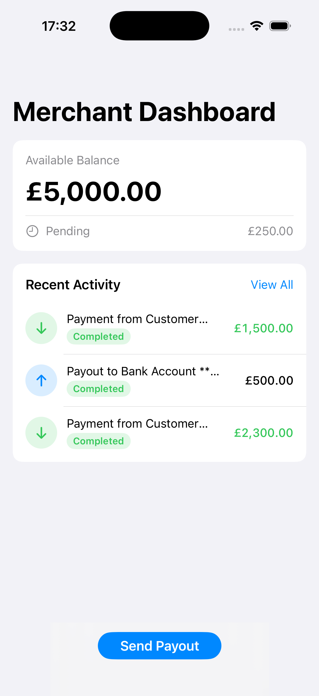</td></tr>
</tbody>
</table>

</details>


### Step 2 - Transaction List (Paginated)

**Goal**: Display full activity history with pagination.

**Requirements**:

* Display the list of all activity items with type, description, amount, and date (formatted as `DD MM YYYY`).
* Implement "Infinite Scroll" functionality on the transaction list modal. Load more items automatically as the user scrolls to the bottom.
* Use cursor-based pagination to fetch additional activity items.
* Handle loading and error states gracefully.
* Group transactions by local date (Today / Yesterday / 18 May 2025).

<details>
<summary>📱 Reference Screenshots</summary>

<table>
<thead><tr><th>iOS</th></tr></thead>
<tbody>
<tr><td>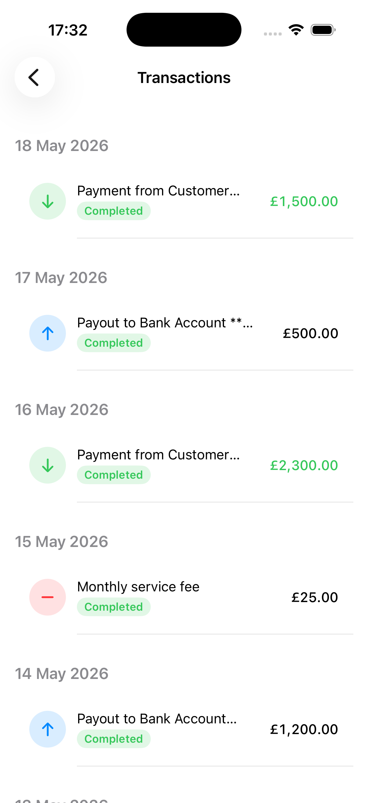</td></tr>
<tr><td>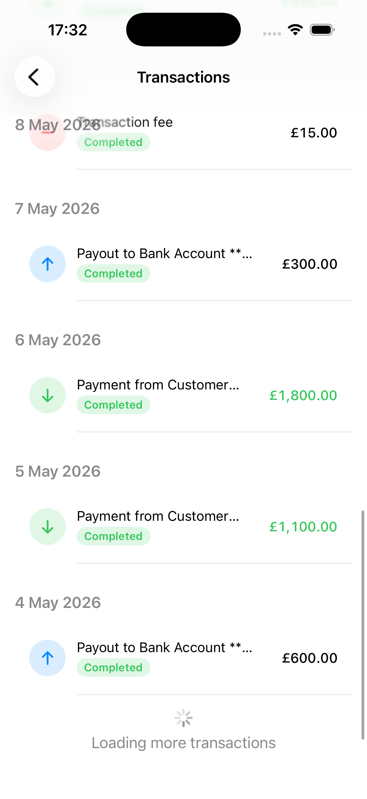</td></tr>
</tbody>
</table>

</details>


### Step 3 - Payout Form & Confirmation

**Goal**: Create a two-step payout flow with validation and error handling.

**Requirements**:

* Use a numeric input field for the payout amount.
* Use a dropdown to select the currency (`GBP` or `EUR`). The currency can be different from the merchant's account currency.
* Capture the destination IBAN 
  * Valid IBAN formats (e.g., `GB29NWBK60161331926819`).
  * Invalid IBAN format (e.g., `FR1212345123451234567A12310131231231231`).
* Ensure the "Confirm" button is disabled if the input is empty, zero, or negative.
* Display a confirmation screen summarizing the transaction before execution (as shown in the reference images).
* Handle success response by showing Payout confirmation with amount and currency.
* Handle failures (e.g., `4xx`, `5xx` errors, insufficient funds) and network errors.

<details>
<summary>📱 Reference Screenshots</summary>

<table>
<thead><tr><th>iOS</th></tr></thead>
<tbody>
<tr><td>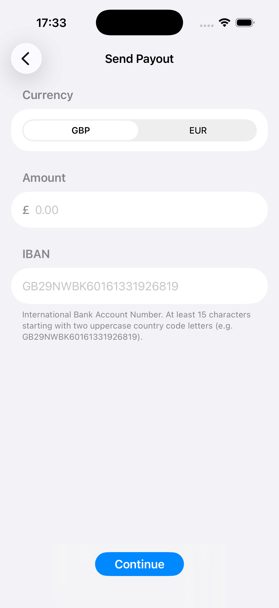</td></tr>
<tr><td>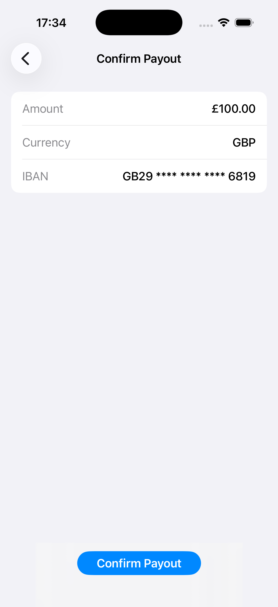</td></tr>
<tr><td>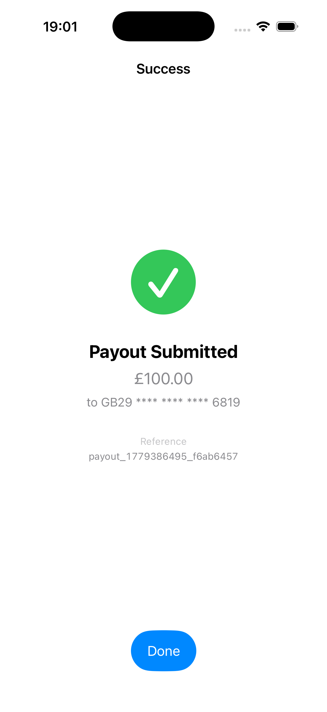</td></tr>
<tr><td>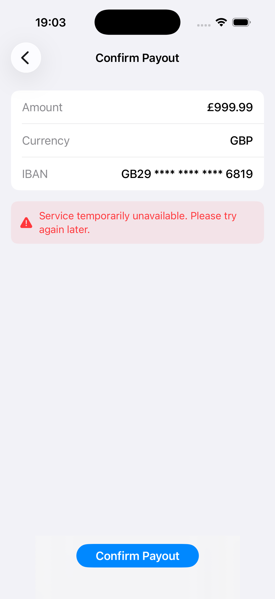</td></tr>
<tr><td>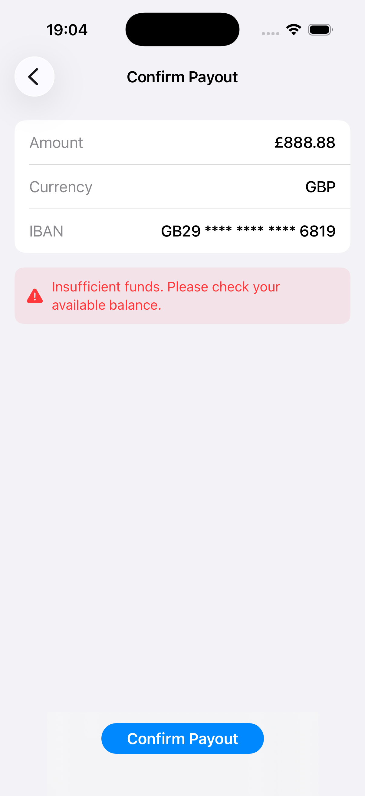</td></tr>
</tbody>
</table>

</details>


### Step 4 - Device Identity

**Goal**: Generate and persist a stable device identifier for payout requests.

**Requirements:**

- Implement a `DeviceIdentityService` that generates a `UUID` on first launch and persists it in the **Keychain** (not `UserDefaults`)
- Returns the same ID on subsequent launches
- Include the `device_id` as a field in your payout request body

<details>
<summary>📱 Reference Screenshots</summary>

<table>
<thead><tr><th>iOS</th></tr></thead>
<tbody>
<tr><td><em>(No visual changes — device ID is sent in the background)</em></td></tr>
</tbody>
</table>

</details>


### Step 5 - Biometric Authentication

**Goal**: Secure high-value payouts with Face ID or Touch ID.

**Requirements:**

- For payouts **over £1,000** (100,000 pence), require biometric authentication (Face ID / Touch ID) before the confirmation screen is shown
- Handle three outcomes: success, user cancellation (show a "cancelled" message), biometrics unavailable (show a fallback message)
- The £1,000 business rule must be **testable independently of hardware**

**Simulator testing**: In Simulator menu, go to `Features > Face ID > Enrolled`. Then trigger your payout and select `Features > Face ID > Matching Face`.

<details>
<summary>📱 Reference Screenshots</summary>

<table>
<thead><tr><th>iOS</th></tr></thead>
<tbody>
<tr><td>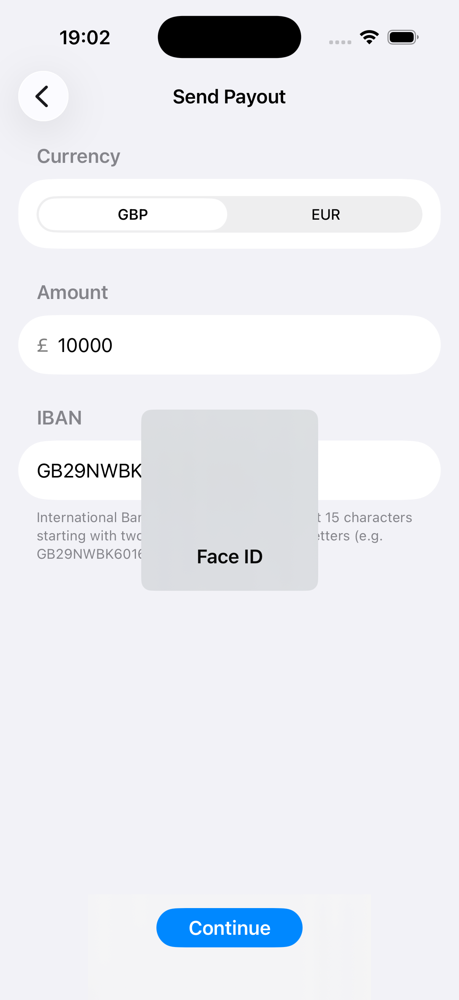</td></tr>
<tr><td>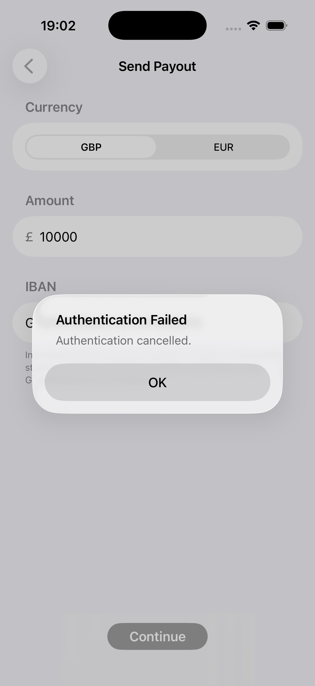</td></tr>
</tbody>
</table>

</details>


### Step 6 - Screenshot Security Alert

**Goal**: Make sure the Merchant is aware of the risk of screenshots on the Payout screen.

**Requirements:**

* **UI Reaction**: On the **Payout** screen, listen for screenshot event and show a non-intrusive warning (like a Toast or an Alert) reminding the user to keep their financial data private.

**Simulator testing**:
* **iOS**: Use **Device → Trigger Screenshot** from the Simulator menu

<details>
<summary>📱 Reference Screenshots</summary>

<table>
<thead><tr><th>iOS</th></tr></thead>
<tbody>
<tr><td>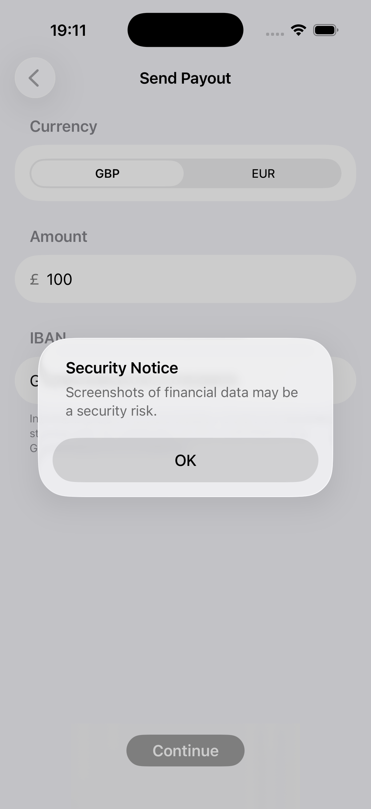</td></tr>
</tbody>
</table>

</details>
